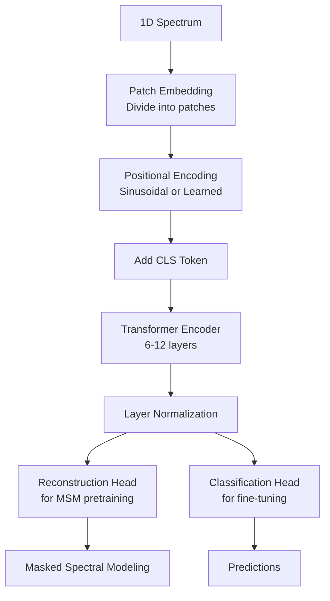

# raman-spectra

This code accompanies the blog post [Analyzing Raman Spectra with Machine Learning](https://www.nbrosse.com/posts/raman/raman.html).

The repository includes notebooks for exploratory data analysis and training traditional PLS models for concentration prediction (see the `notebooks` folder).

It also includes a machine learning toolkit for analyzing Raman spectra using **SpecBERT**, a transformer-based model for spectral analysis. This repository provides tools for self-supervised pretraining on unlabeled spectral data and supervised fine-tuning for classification or regression tasks.

**References:**
- [Dig4Bio Raman Transfer Learning Challenge](https://www.kaggle.com/competitions/dig-4-bio-raman-transfer-learning-challenge)
- [RamanSPy](https://ramanspy.readthedocs.io/en/stable/)

**⚠️ Experimental Code**: The SpecBERT implementation was primarily generated using AI agents as a proof of concept. The motivation is that spectral data is abundant, while concentration measurements are costly, making unsupervised pretraining valuable. This code should be carefully reviewed and improved before production use—it serves as a starting point for further development.

## Installation

Use `uv` to install the dependencies:

```bash
uv sync
```

## Data

Please download the data from the [Dig4Bio Raman Transfer Learning Challenge](https://www.kaggle.com/competitions/dig-4-bio-raman-transfer-learning-challenge) and place it in the `data` folder.

It should be structured as follows:

```
data/
├── dig-4-bio-raman-transfer-learning-challenge/
│   ├── anton_532.csv
│   ├── anton_785.csv
│   ├── kaiser.csv
│   ├── metrohm.csv
│   ├── mettler_toledo.csv
│   ├── tec5.csv
│   ├── timegate.csv
│   └── tornado.csv
```

## Overview of SpecBERT

This package provides a complete toolkit for analyzing Raman spectra using **SpecBERT**, a transformer-based encoder model inspired by BERT and Vision Transformers. SpecBERT uses a self-supervised pretraining approach called **Masked Spectral Modeling (MSM)** followed by supervised fine-tuning for classification or regression tasks.

### Key Features

- **SpecBERT Model**: Transformer-based encoder architecture designed for 1D spectral data
- **Self-Supervised Pretraining**: Masked Spectral Modeling (MSM) for learning rich spectral representations
- **Flexible Fine-tuning**: Support for both classification and regression tasks
- **Multiple Data Formats**: Support for CSV, NumPy, and challenge dataset formats
- **Preprocessing Pipelines**: Integration with RamanSPy for standard spectral preprocessing
- **Multi-Instrument Support**: Combine and analyze data from multiple instruments

## Architecture

### SpecBERT Overview

SpecBERT is a transformer-based encoder model designed specifically for analyzing 1D Raman spectra. The architecture adapts concepts from Vision Transformers (ViT) and BERT to work with spectral data.



### Key Components

#### 1. Patch Embedding (`PatchEmbedding1D`)

The input spectrum is divided into non-overlapping patches of fixed size (default: 16 wavenumber points). Each patch is linearly projected into an embedding space:

- **Input**: 1D spectrum of length N
- **Process**: Reshape into N/patch_size patches, each of dimension patch_size
- **Output**: Patch embeddings of shape (num_patches, embed_dim)

This approach allows the model to:
- Process variable-length spectra (as long as length is divisible by patch_size)
- Learn local spectral features within each patch
- Scale efficiently to longer spectra

#### 2. Positional Encoding

SpecBERT supports two types of positional encodings:

- **Sinusoidal** (default): Fixed positional embeddings using sine and cosine functions of different frequencies, similar to the original Transformer
- **Learned**: Learnable positional embeddings that adapt during training

Positional encoding is critical because transformer attention mechanisms are permutation-invariant; they need explicit position information to understand spectral order.

#### 3. Transformer Encoder Blocks

The core of SpecBERT consists of stacked transformer encoder blocks. Each block includes:

- **Multi-Head Self-Attention**: Allows the model to attend to different spectral regions simultaneously
  - Uses optional xformers for memory-efficient attention on GPU
  - Supports attention dropout for regularization
- **Layer Normalization**: Stabilizes training and improves gradient flow
- **Feed-Forward Network**: Two-layer MLP with GELU activation
- **Residual Connections**: Enable deep network training

#### 4. Dual Head Architecture

SpecBERT uses different heads depending on the training stage:

- **Reconstruction Head** (pretraining): Linear layer that predicts masked patch values for Masked Spectral Modeling
- **Classification/Regression Head** (fine-tuning): Linear layer that maps CLS token embeddings to class labels or continuous values

#### 5. CLS Token

An optional learnable classification token (CLS) is prepended to the patch sequence. During fine-tuning, this token aggregates global spectral information and is used for final predictions via the classification head.

### Masked Spectral Modeling (MSM)

MSM is the self-supervised pretraining objective:

1. Random patches are masked (default: 20% of patches)
2. The model learns to reconstruct the masked patches from visible context
3. Loss is computed only on masked positions using MSE
4. This encourages the model to learn rich representations of spectral patterns

This approach is analogous to BERT's masked language modeling, adapted for continuous spectral data.

### Model Parameters

Key hyperparameters that control SpecBERT's architecture:

- **`patch_size`** (default: 16): Size of each patch in wavenumber points
- **`embed_dim`** (default: 256): Dimension of patch embeddings and hidden states
- **`depth`** (default: 6): Number of transformer encoder blocks
- **`num_heads`** (default: 8): Number of attention heads in multi-head attention
- **`mlp_ratio`** (default: 4.0): Ratio of MLP hidden dimension to embed_dim
- **`mask_ratio`** (default: 0.2): Fraction of patches to mask during pretraining
- **`pos_encoding`**: "sin" (sinusoidal) or "learned" positional encoding
- **`use_cls_token`** (default: True): Whether to use a CLS token for classification

## Source Code Documentation

### Configuration (`config.py`)

The `TrainConfig` dataclass provides a centralized configuration system for all training parameters:

```python
@dataclass
class TrainConfig:
    # Training parameters
    batch_size: int = 64
    lr: float = 3e-4
    epochs: int = 50
    device: str = "cuda" if torch.cuda.is_available() else "cpu"
    num_workers: int = 2
    
    # Model parameters
    patch_size: int = 16
    mask_ratio: float = 0.2
    depth: int = 6
    embed_dim: int = 256
    heads: int = 8
    classes: int | None = None  # Required for classification tasks
    
    # Data loading parameters
    mode: Literal["pretrain", "finetune"] = "pretrain"
    input_path: str = ""  # Path to data file or directory
    format: Literal["csv", "npy", "challenge"] = "csv"
    wavenumbers_path: str | None = None  # For npy format
    labels_path: str | None = None  # For supervised tasks
    instruments: list[str] | None = None  # For challenge format
    target_column: str = "glucose"  # For challenge format regression
    val_split: float = 0.0  # Validation split (0.0-0.5)
```

**Key Configuration Options:**

- **`mode`**: Choose between "pretrain" (MSM) or "finetune" (supervised learning)
- **`format`**: Data format - "csv", "npy", or "challenge" (for challenge dataset)
- **`classes`**: Number of classes for classification (None for regression)
- **`val_split`**: Fraction of data to use for validation during fine-tuning

### Data Loading (`data.py`)

The `data.py` module provides flexible data loading utilities and PyTorch dataset classes.

#### Data Loading Functions

**`load_csv(path)`**
- Loads spectra from CSV files where columns are either metadata or wavenumbers
- Automatically identifies spectral columns (numeric column names) vs metadata
- Returns: `(wavenumbers, spectra_matrix, metadata_df)`

**`load_numpy(spectra_path, wavenumbers_path=None)`**
- Loads spectra from NumPy `.npy` files
- If `wavenumbers_path` is None, uses indices as wavenumbers
- Returns: `(wavenumbers, spectra)`

**`load_raman_challenge_dataset(data_dir, instruments=None)`**
- Loads the Dig4Bio challenge dataset from a directory
- Can filter by specific instruments (e.g., `["anton_532", "kaiser"]`)
- Automatically loads target data if available
- Returns: `(instrument_data_dict, target_df)`

**`combine_instrument_data(instrument_data, interpolate_wavenumbers=True, target_wavenumbers=None)`**
- Combines spectra from multiple instruments into a single dataset
- Interpolates spectra to a common wavenumber grid if needed
- Returns: `(wavenumbers, combined_spectra, instrument_labels)`

#### Dataset Classes

**`SpectraDataset`**
- Base dataset class for spectra
- Applies preprocessing if provided
- Returns: `(wavenumbers_tensor, spectrum_tensor)`

**`MaskedSpectraDataset`**
- Extends `SpectraDataset` for MSM pretraining
- Randomly masks patches according to `mask_ratio`
- Returns: `(wavenumbers_tensor, spectrum_tensor, patch_mask)`
- Automatically crops spectra to be divisible by `patch_size`

**`LabeledSpectraDataset`**
- Extends `SpectraDataset` for supervised learning
- Includes labels for classification or regression
- Returns: `(wavenumbers_tensor, spectrum_tensor, label_tensor)`

### Preprocessing (`preprocess.py`)

The preprocessing module provides integration with RamanSPy for standard spectral preprocessing.

**`SpectralPreprocessor`**
- Wrapper class that adapts RamanSPy pipelines to work with NumPy arrays
- Provides `apply(wavenumbers, spectrum)` method compatible with dataset classes

**`build_standard_pipeline(crop_region=(300, 1942), normalize=False)`**
- Creates a standard preprocessing pipeline with:
  1. Cropping to fingerprint region (optional)
  2. Whitaker-Hayes cosmic ray removal
  3. Savitzky-Golay smoothing (window=9, polyorder=3)
  4. ASPLS baseline correction
  5. MinMax normalization (optional)
- Set `normalize=True` for classification, `False` for regression

**`build_pipeline_without_normalisation(crop_region=(300, 1942))`**
- Convenience function for regression tasks where normalization may distort concentration relationships

### Model (`model.py`)

The `model.py` module contains the SpecBERT architecture implementation.

**`SpecBERT`**
- Main model class implementing the transformer encoder architecture
- Supports both pretraining (with reconstruction head) and fine-tuning (with classification head)
- Parameters:
  - `patch_size`, `embed_dim`, `depth`, `num_heads`: Architecture dimensions
  - `mlp_ratio`: MLP expansion ratio
  - `pos_encoding`: "sin" or "learned"
  - `use_cls_token`: Whether to use CLS token
  - `recon_head`: Include reconstruction head (for pretraining)
  - `num_classes`: Number of output classes (None for regression)
- Forward pass returns: `(tokens, reconstruction, logits)`

**Supporting Classes:**
- `PatchEmbedding1D`: Converts 1D spectra to patch embeddings
- `MultiheadSelfAttention`: Multi-head self-attention with optional xformers
- `TransformerEncoderBlock`: Complete encoder block with attention and MLP

### Training (`train.py`)

The training module provides functions for pretraining, fine-tuning, and evaluation.

**`pretrain_msm(spectra, wavenumbers, model, preprocessor, cfg)`**
- Pretrains SpecBERT using Masked Spectral Modeling
- Uses `MaskedSpectraDataset` to create masked patches
- Optimizes MSE loss on masked positions only
- Model should have `recon_head=True`

**`finetune_supervised(spectra, wavenumbers, labels, model, preprocessor, cfg)`**
- Fine-tunes SpecBERT for classification or regression
- Automatically detects task type from label dtype (int = classification, float = regression)
- Uses CLS token or mean pooling for final predictions
- Only trains classifier head by default (encoder weights can be frozen)

**`evaluate_supervised(spectra, wavenumbers, labels, model, preprocessor, cfg)`**
- Evaluates model performance on a dataset
- Returns metrics dictionary with "loss" and optionally "accuracy" (for classification)

**`main(cfg: TrainConfig)`**
- Main entry point that handles data loading, model creation, and training orchestration
- Supports all data formats (csv, npy, challenge)
- Automatically saves pretrained model weights with `.specbert.pt` extension
- Handles train/validation splits for fine-tuning

## Usage Examples

### Example 1: Pretraining SpecBERT on Challenge Dataset

This example shows how to pretrain SpecBERT on the challenge dataset, combining data from multiple instruments:

```python
from raman_spectra import TrainConfig, main

# Configure pretraining
cfg = TrainConfig(
    mode="pretrain",
    format="challenge",
    input_path="data/dig-4-bio-raman-transfer-learning-challenge",
    instruments=["anton_532", "kaiser", "metrohm"],  # Use specific instruments, or None for all
    batch_size=32,
    lr=3e-4,
    epochs=50,
    patch_size=16,
    mask_ratio=0.2,
    depth=6,
    embed_dim=256,
    heads=8,
    device="cuda",  # Use "cpu" if no GPU available
    num_workers=4,
)

# Run pretraining
main(cfg)
```

**What happens:**
1. Data from specified instruments is loaded and combined
2. Spectra are interpolated to a common wavenumber grid
3. SpecBERT model is initialized with reconstruction head
4. Model is pretrained using Masked Spectral Modeling
5. Model weights are saved to `data/dig-4-bio-raman-transfer-learning-challenge.specbert.pt`

**Output:**
```
Loaded 1000 spectra from anton_532 with 1024 wavenumbers
Loaded 800 spectra from kaiser with 2048 wavenumbers
Loaded 900 spectra from metrohm with 512 wavenumbers
pretrain epoch 1/50: 100%|████████| 85/85 [00:15<00:00, loss=0.0234]
...
Saved checkpoint to data/dig-4-bio-raman-transfer-learning-challenge.specbert.pt
```

### Example 2: Fine-tuning for Regression

This example shows how to load a pretrained model and fine-tune it for regression (e.g., predicting glucose concentration):

```python
import torch
from raman_spectra import TrainConfig, SpecBERT, main

# First, load pretrained weights (from Example 1)
pretrained_path = "data/dig-4-bio-raman-transfer-learning-challenge.specbert.pt"

# Configure fine-tuning
cfg = TrainConfig(
    mode="finetune",
    format="challenge",
    input_path="data/dig-4-bio-raman-transfer-learning-challenge",
    instruments=["anton_532"],  # Use single instrument for fine-tuning
    target_column="glucose",  # Predict glucose concentration
    batch_size=32,
    lr=1e-4,  # Lower learning rate for fine-tuning
    epochs=30,
    patch_size=16,  # Must match pretraining
    depth=6,  # Must match pretraining
    embed_dim=256,  # Must match pretraining
    heads=8,  # Must match pretraining
    classes=None,  # None for regression
    val_split=0.2,  # Use 20% for validation
    device="cuda",
    num_workers=4,
)

# Run fine-tuning (model will be created with classification head)
main(cfg)
```

**For classification tasks**, set `classes` to the number of classes:

```python
cfg = TrainConfig(
    mode="finetune",
    # ... other parameters ...
    classes=5,  # Number of classes for classification
    # ... rest of config ...
)
```

**What happens:**
1. Data is loaded with labels from the target column
2. SpecBERT model is created with classification/regression head (no reconstruction head)
3. Pretrained weights should be loaded manually if continuing from pretraining:
   ```python
   model = SpecBERT(
       patch_size=cfg.patch_size,
       embed_dim=cfg.embed_dim,
       depth=cfg.depth,
       num_heads=cfg.heads,
       recon_head=False,
       num_classes=None,  # or number of classes
   )
   state_dict = torch.load(pretrained_path)
   model.load_state_dict(state_dict, strict=False)  # strict=False to skip classifier head
   ```
4. Model is fine-tuned on the labeled data
5. Validation metrics are printed if `val_split > 0`

**Output:**
```
Loaded 1000 spectra from anton_532 with 1024 wavenumbers
Loaded target data from 96_samples.csv with shape (1000, 5)
finetune epoch 1/30: 100%|████████| 25/25 [00:08<00:00, loss=12.34]
...
{'loss': 8.76, 'rmse': 2.96}  # For regression
# or
{'loss': 0.45, 'accuracy': 0.87}  # For classification
```

### Example 3: Programmatic Usage

For more control, you can use the modules programmatically:

```python
import numpy as np
import torch
from raman_spectra import (
    TrainConfig,
    SpecBERT,
    load_raman_challenge_dataset,
    combine_instrument_data,
    SpectralPreprocessor,
    pretrain_msm,
    finetune_supervised,
    evaluate_supervised,
)

# Load and combine data
instrument_data, target_df = load_raman_challenge_dataset(
    "data/dig-4-bio-raman-transfer-learning-challenge",
    instruments=["anton_532", "kaiser"]
)
wn, spectra, _ = combine_instrument_data(instrument_data)

# Create preprocessor
preprocessor = SpectralPreprocessor()

# Create model
model = SpecBERT(
    patch_size=16,
    embed_dim=256,
    depth=6,
    num_heads=8,
    recon_head=True,  # For pretraining
)

# Pretrain
train_cfg = TrainConfig(
    batch_size=32,
    lr=3e-4,
    epochs=50,
    patch_size=16,
    mask_ratio=0.2,
    device="cuda",
)
pretrain_msm(spectra, wn, model, preprocessor, train_cfg)

# Save pretrained model
torch.save(model.state_dict(), "pretrained_model.pt")

# Fine-tune for regression
# Create new model with classification head
model_ft = SpecBERT(
    patch_size=16,
    embed_dim=256,
    depth=6,
    num_heads=8,
    recon_head=False,  # No reconstruction head
    num_classes=None,  # Regression
)

# Load pretrained weights (excluding classifier)
pretrained = torch.load("pretrained_model.pt")
model_ft.load_state_dict(pretrained, strict=False)

# Prepare labels
labels = target_df["glucose"].values[:len(spectra)]

# Fine-tune
finetune_cfg = TrainConfig(
    batch_size=32,
    lr=1e-4,
    epochs=30,
    patch_size=16,
    device="cuda",
)
finetune_supervised(spectra, wn, labels, model_ft, preprocessor, finetune_cfg)

# Evaluate
metrics = evaluate_supervised(spectra, wn, labels, model_ft, preprocessor, finetune_cfg)
print(f"Final metrics: {metrics}")
```

## API Reference

### Main Classes

- **`TrainConfig`**: Configuration dataclass for training
- **`SpecBERT`**: Main transformer model
- **`SpectralPreprocessor`**: Preprocessing wrapper
- **`SpectraDataset`**: Base dataset class
- **`MaskedSpectraDataset`**: Dataset for MSM pretraining
- **`LabeledSpectraDataset`**: Dataset for supervised learning

### Main Functions

- **`main(cfg)`**: Main training entry point
- **`pretrain_msm(...)`**: Pretraining function
- **`finetune_supervised(...)`**: Fine-tuning function
- **`evaluate_supervised(...)`**: Evaluation function
- **`load_csv(path)`**: Load CSV data
- **`load_numpy(...)`**: Load NumPy data
- **`load_raman_challenge_dataset(...)`**: Load challenge dataset
- **`combine_instrument_data(...)`**: Combine multi-instrument data
- **`build_standard_pipeline(...)`**: Build preprocessing pipeline

For detailed API documentation, see the docstrings in the source code.